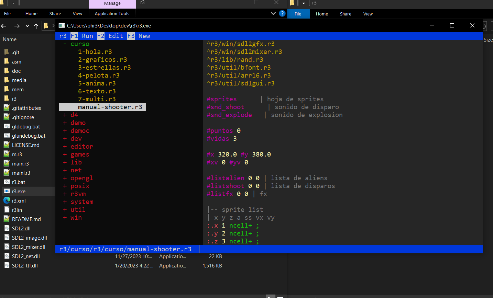
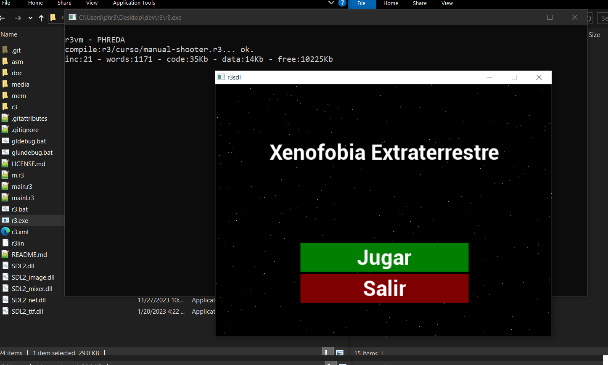

# R3 programming language

R3 is a concatenative language of the forth family, it takes elements of ColorForth. 
Word colors are encoded by a prefix: in r3 this prefix is explicit.

The size of cells is 64 bits, but you can access to memory in 8,16 or 32 bit size.

R3 can load and call procedures from any dynamic library (.DLL in windows) the distro use SDL2 library for make games.

Download the code of this repository, uncompress and execute r3.exe

The main.r3 execute by r3.exe is a browser for files in /r3 folder

with the keys you can navigate while see the code in the left side of the screen.

Edit with F2 or execute with F1 the code in this folder. When execute a code with F1 you can see in terminal the compilation

## Programs in the distributions

## [WIKI](https://github.com/phreda4/r3/wiki/Welcome-to-the-r3-wiki!)

## [How the language works](https://github.com/phreda4/r3/wiki/Mini-Manual-R3)

## [More code to play](https://github.com/phreda4/r3-games)

## [Youtube Videos](https://www.youtube.com/@pablohreda)

## [History](https://github.com/phreda4/r3/wiki/History)

The language use a virtual machine for work, this is the source code for this lang:
https://github.com/phreda4/r3evm

